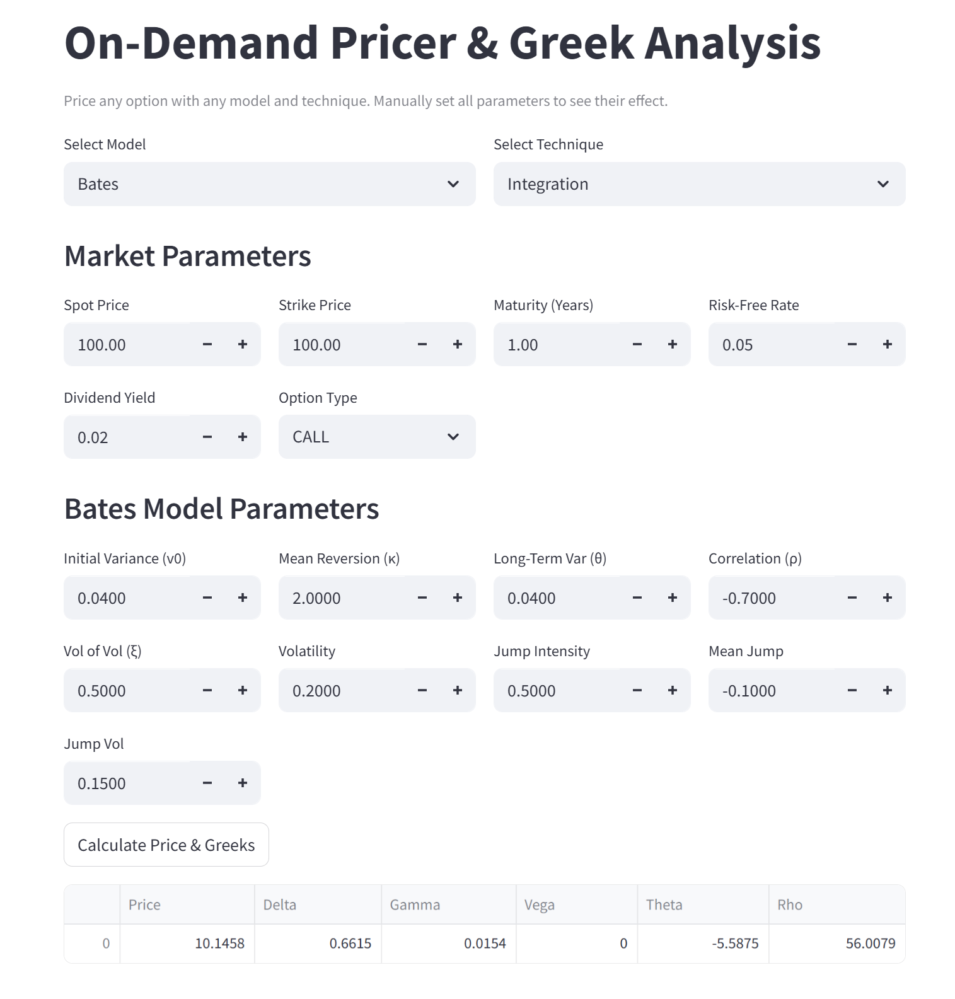
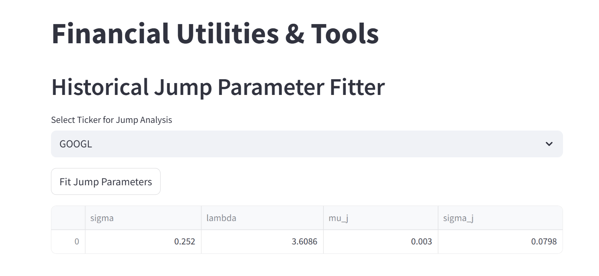
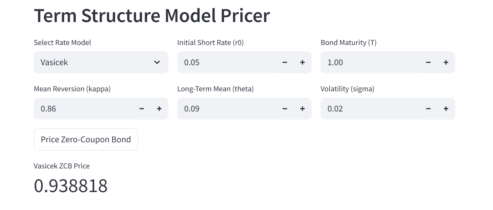

# Using the Interactive Dashboard

The `optpricing` library includes an interactive dashboard built with Streamlit,
providing a visual interface for the library's core features.

## Launching the Dashboard

To use the dashboard, you must first install the library with the `[app]` extra dependencies:

```bash
pip install optPricing[app]
```

Once installed, you can launch the application from your terminal with a single command:

```bash
optpricing dashboard
```

This will open the application in a new browser tab.

## Dashboard Pages

The dashboard is organized into several pages, accessible from the sidebar on the left.

### Calibration

This is the main page for model calibration. It allows you to select a ticker and one or more models, run the calibration workflow, and see a detailed analysis of the results.


### Pricer and Greeks

This page is an interactive pricing tool that allows you to explore the behavior of different models and techniques in real-time. You can adjust all market and model parameters to see their effect on the option price and its Greeks.


### Financial Tools

This page provides access to several utility functions from the library for more specific analyses.
Historical Jump Fitter: Select a ticker to estimate jump-diffusion parameters directly from its historical returns data.


Term Structure Pricer: Price a zero-coupon bond using interest rate models like Vasicek or CIR.


